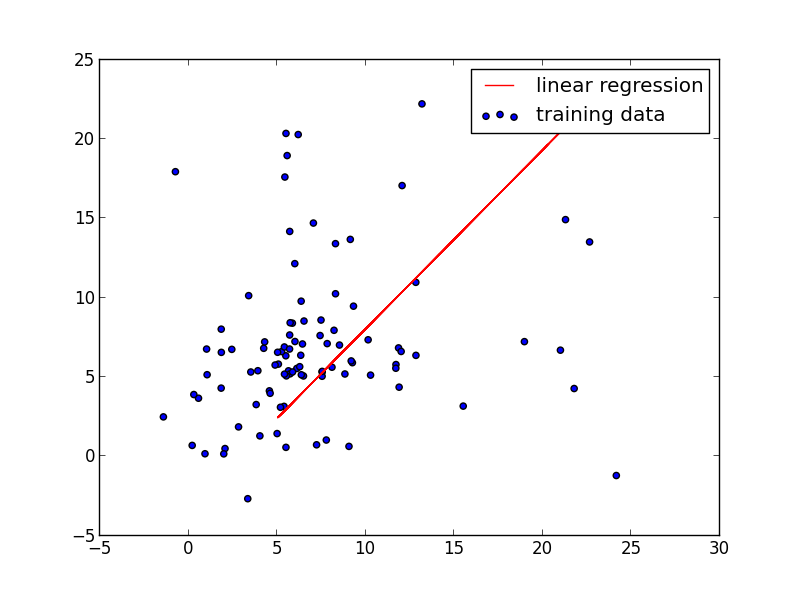
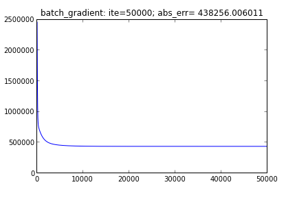
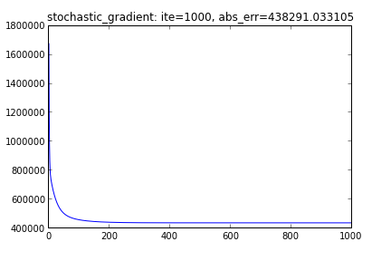

# 机器学习 - 线性回归

## 介绍

有监督学习方法通常具有三个要素：假设模型、优化目标(cost function)、算法。

### 假设模型

线性回归的建设模型用 $h(x)$ 表示：

$$ h(x) = \sum_{i=0}^{n}{\theta_i x_i} = \theta^T x $$

其中 $\theta$ 称为参数或权重， $x$ 为输入或特征，$n$ 为特征个数（不包括$x_0$）

### 优化目标

线性回归的优化目标是使cost function最小，其中cost function 用 $J(\theta)$ 表示， 为

$$ J(\theta) = \frac{1}{2} \sum_{i=1}^{n} (h_{\theta}(x^{(i)})-y^{(i)})^2 $$

这个函数叫做普通最小二乘函数（ordinary least squares）。

### 算法

1. 梯度下降法

    可以使用梯度下降法来求得最小二乘函数的最小值，梯度下降法表示为

    $$ \theta_j := \theta_j - \alpha  \frac{\partial}{\partial \theta_j} J(\theta) $$

    其中$\theta$开始与初始猜测值，并且更新同时作用于所有参数$j= 0, ... n$。其中$\alpha$为学习速度，控制每步更新的幅度。
     
    对于最小二乘函数，可求得其偏导数为：

    $$ \frac{\partial}{\partial \theta_j} J(\theta) = (h_\theta (x)-y)x_j$$

    因此对于一个训练样本，更新规则为：

    $$\theta_j := \theta_j + \alpha(y^{(i)} - h_\theta (x^{(i)})) x_j ^{(i)} $$

    这就是所谓的最小二乘法（Least Mean Squares, LMS）,也叫Widrow-Hoff法。

    当训练样本多于一个时，由此引出两种方法可以处理多个样本的样本集：批梯度下降法(batch gradient descent) 和随机梯度下降法或增量梯度下降法(stochastic gradient descent or incremental gradient descent).

    1.1. 批梯度下降法

    > Repeat until convergence {

    > $\theta_j := \theta_j + \alpha \frac{1}{m} \sum_{i=1}^{m} (y^{(i)} - h_\theta (x^{(i)})) x_j ^{(i)} $  (for every $j$)

    > }

    该方法每次更新基于所有$m$个训练样本，由于$J$是一个凸二次函数，因此没有局部最小值，只有唯一一个全局最小值，因此该方法保证收敛到（学习速率$\alpha$不太大）全局最小点。缺点是当$m$太大时，每次更新都基于全部样本，成本太高，因此有了随机梯度下降法。

    1.2. 随机梯度下降法

    > Loop {

    > for i=1 to m, {

     >    $\theta_j := \theta_j + \alpha(y^{(i)} - h_\theta (x^{(i)})) x_j ^{(i)}$ (for every $j$)

    >    }

    >}

    该算法每次更新基于一个训练样本，因此也叫做增量梯度下降法，当训练样本特别大时，应用批梯度下降法成本太高时可以使用该方法。该方法的缺点是：通常该方法只能找到全局最小点的近似值，当到达最小点附近时可能发生振荡而永远找不到全局最小值，但实际应用中最小值附近的近似值已经够用了。（PS. 实际使用中随着算法的运行可以减小学习速度$\alpha$的值到0附近，来避免一直振荡从而实现收敛）

2. 标准方程法(normal equations)

    梯度下降是一种求得$J$最小值的方法，是一种迭代的方法。另一种方法是一种直接求得解析解的方法，叫做标准方程法。数学中我们知道，导数为零时出现极值，对于$J$极值为最小值，为我们所求。基于该思想，通过构造矩阵，可以直接求出$J$最小时的$\theta$值。不推导直接给出结果：

    $$ \theta = (X^T X)^{-1} X^T Y$$

    其中$X$ 为$m-by-n+1$的矩阵，$(x^{(i)})^T$ 为第$i$个训练样本:

    $$ X = \left[ \begin{array}{c} (x^{(1)})^T \\ (x^{(2)})^T \\ ... \\ (x^{(m)})^T \end{array} \right]$$

    其中$Y$ 为$m$维的向量，$y^{(i)}$ 为第$i$个目标值

    $$ Y = \left[ \begin{array}{c} y^{(1)} \\ y^{(2)} \\ ... \\ y^{(m)} \end{array} \right]$$

    使用该方法可以一步计算出所求参数值，不需迭代。但是当矩阵很大时，求矩阵的逆代价较高，而且如果选取的特征是线性相关的，则矩阵的逆不存在，需要使用伪逆代替。

    综上所述，当特征较少且相互独立时可以使用标准方程的方法求得参数，否则使用梯度下降法。使用梯度下降法时如果训练样本较少，使用批梯度下降法，得到全局最小点；否则使用随机梯度下降法，得到近似全局最小点。

### 相关技巧

在使用线性回归模型时，有两个需要注意的技巧：特征归一化（feature scaling）和学习速度$\alpha$的设定。

1. 特征归一化
    
    当线性回归模型中有多个特征时，如果其中某个特征的取值范围相比其它特征的取值范围大很多，那么这个特征对最后的假设模型中容易产生比较大的影响，为了获得较好的学习效果，需要使各特征的取值范围相似，这个过程称为归一化。其中最直接的一种方法是平均标准化（mean normalization）：

    $$ x_j = \frac{x_j - \mu_j}{s_j}$$

    其中$x_j$为特征，$\mu_j$为特征的平均值，$s_j$为特征的取值范围，通过这一过程，所有特征的取值范围被规范到$[-0.5,0.5]$ 的范围内。

2. 学习速度设定
    
    学习速度$\alpha$决定算法收敛的快慢，当其取值小时，能够保证收敛但收敛太慢；当取值大时，可能出现震荡而不收敛。因此需要选取合适的学习速度。但没有方法直接选取最好的学习速度，只能是收敛性和收敛速度二者的权衡，需要在实验中观察结果来选取合适的$\alpha$值。

## 代码实现

`linear_regression.py`

    import numpy as np
    import pylab as pl

    def mean_normalization(X_set):
        m, n = X_set.shape

        for j in range(1,n):
            x_j = X_set[:,j]
            x_j_mean = np.mean(x_j)
            x_j_range = np.max(x_j) - np.min(x_j)

            x_j = (x_j - x_j_mean) / (x_j_range + np.spacing(1))
            X_set[:,j] = x_j

        return X_set

    def normal_equation(X, y, learning_rate = 0):
        theta = np.linalg.pinv(X.T * X) * X.T * y
        return theta

    def batch_gradient(X, y, learning_rate = 1e-1):
        epsilon = 1e-3 # converged if error is less than epsilon
        max_iter = 1e4 # max iterator number of loop

        m, n = X.shape
            
        theta = np.asmatrix( np.zeros([n,1]) )
        ite = 0
        abs_err = list()
        abs_err.append(1e5)

        while ite < max_iter and abs_err[-1] > epsilon: 
            for j in range(n):
                theta[j] = theta[j] + learning_rate * 1/m * ( (y - X * theta).T * X[:,j] )

            abs_err.append( np.linalg.norm( X * theta - y ) )
            ite += 1
            print str(ite) + " abs_err: " + str(abs_err[-1])

        return theta

    def stochastic_gradient(X, y, learning_rate = 1e-2):
        epsilon = 1e-3 # converged if error is less than epsilon
        max_iter = 1e3 # max iterator number of loop

        m, n = X.shape
        theta = np.asmatrix( np.zeros([n,1]) )
        ite = 0
        abs_err = list()
        abs_err.append(1e5)

        while ite < max_iter and abs_err[-1] > epsilon: 
            for i in range(m):
                for j in range(n):
                    theta[j] = theta[j] + learning_rate * ( y[i,:] - X[i,:] * theta) * X[i,j]
           
            ite += 1
            abs_err.append( np.linalg.norm( X.dot(theta) - y ) )
            print str(ite) + " abs_err: " + str(abs_err[-1])

        return theta
        
    class LinearRegression(object):
        """Linear regression model:"""
        def __init__(self, feature_scaling = None):
            self.feature_scaling = feature_scaling
            self.theta = None

        def train(self, X_train, y_train, algorithm = normal_equation, learning_rate = 0.01):

            if X_train.shape[0] != y_train.shape[0]:
                print "different size of X and y in training set"
            
            m, n = X_train.shape

            # feature scaling
            if self.feature_scaling is not None:
                X_train = self.feature_scaling(X_train)

            # training parameter
            self.theta = algorithm(X_train, y_train, learning_rate)

            print self.theta
            
        def predict(self, X_test):
            # feature scaling
            if self.feature_scaling is not None:
                X_test= self.feature_scaling(X_test)

            y_test = self.theta.T * X_test
            return y_test

## 例子

1. 一元线性回归例子：

    $h(x) = \theta_0 + \theta_1 * x_1$ 

    对此线性函数找到合适的参数。

    `linear_regression.py`

        def main():
            datasets = np.genfromtxt('data.txt', delimiter=',')
            X_train = np.matrix (datasets[:, :-1])
            m, n = X_train.shape
            X_train = np.c_[np.ones([m,1]), X_train]
            y_train = np.matrix (datasets[:, -1]).T

            lr = LinearRegression(feature_scaling=None)
            lr.train(X_train, y_train, algorithm = batch_gradient)

            pl.scatter(X_train[:,1], y_train)
            pl.plot(X_train[:,1], X_train * lr.theta, 'r')
            pl.show()

        if __name__ == '__main__':
            main()

    回归结果如图

    

2. 多元线性回归例子

    $h(x) = \theta_0 + \theta_1 * x_1 + \theta_2 * x_2 $ 

    对此二元函数，找到合适的参数。对比实验，来比较不同梯度下降算法的性能。

    
    

    通过二图比较可知，随机梯度下降法算法学习速度快,能够收敛到一个近似的全局最小点。当数据量大时优势尤为明显。 

## 总结

本文介绍来线性回归的原理以及实现，并通过实例给出回归结果及算法性能比较。通过本文可以了解机器学习中的线性回归算法，对于实际问题是否使用该算法还需要模型选择的知识，对于使用该算法的问题，还需要研究如何选择特征才能够达到好的学习性能，这些问题将在以后的文章中介绍。